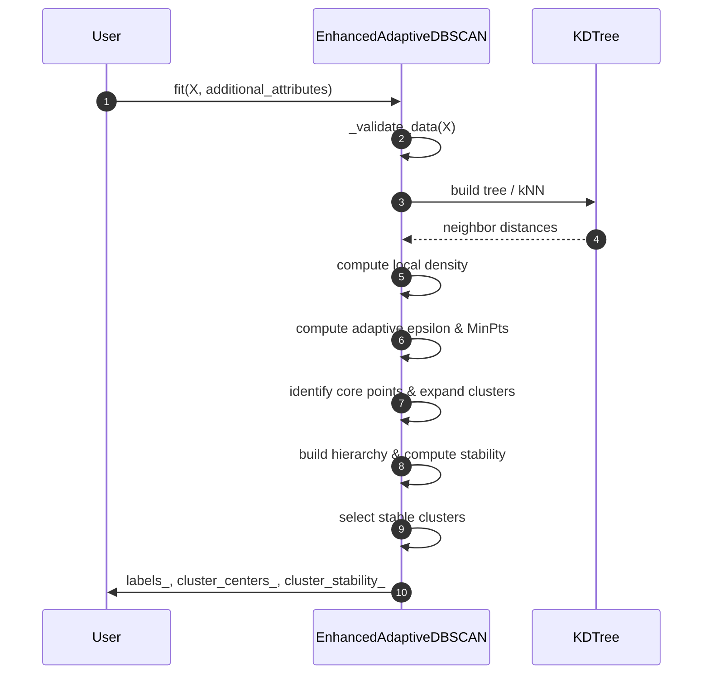
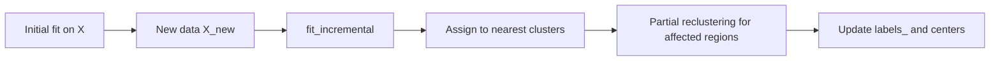
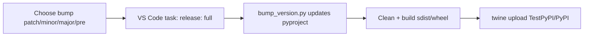

# Workflows

This page visualizes common flows using Mermaid to clarify the algorithm and maintenance workflows.

## Clustering pipeline

```mermaid
sequenceDiagram
  autonumber
  participant U as User
  participant M as EnhancedAdaptiveDBSCAN
  participant KD as KDTree
  U->>M: fit(X, additional_attributes)
  M->>M: _validate_data(X)
  M->>KD: build tree / kNN
  KD-->>M: neighbor distances
  M->>M: compute local density
  M->>M: compute adaptive epsilon & MinPts
  M->>M: identify core points & expand clusters
  M->>M: build hierarchy & compute stability
  M->>M: select stable clusters
  M->>U: labels_, cluster_centers_, cluster_stability_
```

## Incremental update

```mermaid
flowchart LR
  X0[Initial fit on X] --> U1[New data X_new]
  U1 --> F1[fit_incremental]
  F1 --> C1[Assign to nearest clusters]
  C1 --> P1[Partial reclustering for affected regions]
  P1 --> O1[Update labels_ and centers]
```

## Release workflow (local)

```mermaid
flowchart LR
  A[Choose bump patch/minor/major/pre] --> B[VS Code task: release: full]
  B --> C[bump_version.py updates pyproject]
  C --> D[Clean + build sdist/wheel]
  D --> E[twine upload TestPyPI/PyPI]
```
